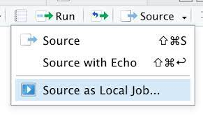

```{r setup, include=FALSE}
install_and_load <- function(pkg){
  new.pkg <- pkg[!(pkg %in% installed.packages()[, "Package"])]
  if (length(new.pkg)) 
    install.packages(new.pkg, dependencies = TRUE)
  sapply(pkg, require, character.only = TRUE)
}
packages <- c("learnr","httr","knitr","rapiclient")
install_and_load (packages)
knitr::opts_chunk$set(echo = FALSE)
```


## Outline


This tutorial will help you set up your computer to use the API of ISEED's argument extractor and aggregator (ISEED-AEA). 
The ISEED-AEA API, and its causal argument extraction methods, have been first presented and employed in the following (preprint) paper:

- Santagiustina, C., & Warglien, M. (2021). The unfolding structure of arguments in online debates: The case of a no-deal brexit. arXiv preprint [arXiv:2103.16387](https://arxiv.org/pdf/2103.16387.pdf).

Please cite this paper to refer to the digital methods contained in the API.

This tutorial can help you:

* Install R
* Install the RStudio IDE
* Install `plumber` and other R package
* Start the ISEED-AEA API
* Send a GET request to one of the endpoints of the API and parse the answer
* Use `rapiclient` to automatically generate a R client library for the API

### Is this tutorial for you?

Do you need to work through the tutorial? Take the quiz below to find out.


```{r quiz1, echo = FALSE}
question("Check all that you have NOT done:",
  answer("installed R on my computer", message = "* Install R"),
  answer("installed the RStudio IDE", message = "* Install RStudio IDE"),
  answer("installed the plumber R package", message = "* Install Packages"),
  answer("started the ISEED-AEA API", message = "* Start API"),
  answer("sent a GET request to one of the endpoints of the API", message = "* GET requests"),
    answer("used `rapiclient` to automatically generate a R client library for the API", message = "* Use the`rapiclient` R library"),
  answer("None of the above. I've done them all.", correct = TRUE, message = "You can skip this tutorial!"),
  type = "multiple",
  incorrect = "This tutorial is here to help! To get set up read:"
)
```

## Install R

### How to install R


### Test your knowledge

```{r quiz2, echo=FALSE}
quiz(caption = "Quiz - Install R",
  question("Is R free to download and use?",
    answer("Yes!", correct = TRUE, message = "R is free _and_ open source, which means that anyone can read, use, and copy the source code of the R language."),
    answer("No.")
  ),
  question("Where do you download R?",
    answer("www.rstudio.com/download"),
    answer("[cloud.r-project.org](http://cloud.r-project.org)", correct = TRUE, message = "You can also download R from [cran.r-project.org](http://cran.r-project.org)"),
    answer("www.r-project.org", message = "Good try, but not exactly. www.r-project.org doesn't provide a download link, but it does provide a link to one the websites above."),
    answer("www.r.com"),
    allow_retry = TRUE
  ),
  question("How often should you update R?",
    answer("Everytime you use it", message = "This will be too often unless you use R very rarely!"),
    answer("About once a year", correct = TRUE, "A new version of R is released about once a year. Update sooner if you encounter a bug that you cannot explain."),
    answer("Never", message = "A new version of R is released about once a year. I'll assume that you are using the newest version of R, which will be the fastest version with the fewest unexpected behaviors." ),
    allow_retry = TRUE
  )
)
```

## Install RStudio

### How to install RStudio

RStudio is an Integrated Development Environment for R. What does that mean? Well, if you think of R as a language, which it is, you can think of RStudio as a program that helps you write and work in the language. RStudio makes programming in R much easier and I suggest that you use it!


### Test your knowledge

```{r quiz3, echo=FALSE}
quiz(caption = "Quiz - Install RStudio",
  question("What is the RStudio IDE?",
    answer("An application that makes it easier to use R.", correct = TRUE, message = "RStudio organizes your workspace and makes it easier to write, use, debug, and save R code. I highly recommend it and will rely on the RStudio IDE in several tutorials."),
    answer("An application that let's you use R without writing any code", message = "And thank goodness! Code provides a reproducible record of your work, which is essential for data science."),
    answer("A spreadsheet program like Microsoft Excel."),
    answer("Another name for R", message = "R and RStudio are two separate things. R is a language, like English. Think of RStudio as a program that helps you use the language, kind of like how a word processing program helps you write in English."),
    allow_retry = TRUE
  ),
  question("Is the RStudio IDE free to download and use?",
    answer("Yes!", correct = TRUE, message = "Like R, RStudio is free and open-source. There do exist professional versions of RStudio with enhanced features, but we will not rely on those features in these tutorials."),
    answer("No.", message = "Like R, RStudio is free and open-source. There do exist professional versions of RStudio with enhanced features, but we will not rely on those features in these tutorials.")
  ),
  question("Where do you download RStudio?",
    answer("www.rstudio.com/download", correct = TRUE, message = "For these tutorials, download and install the RStudio Desktop Open Source License."),
    answer("[cloud.r-project.org](http://cloud.r-project.org)", message = "This is where you download R, not RStudio."),
    answer("www.r-project.org"),
    answer("[cran.rstudio.org](http://cran.rstudio.org)"),
    allow_retry = TRUE
  ),
  question("Do you need to install R if you already have RStudio?",
    answer("Yes.", correct = TRUE),
    answer("No.", message = "R does not come with RStudio; you need to install R separately.")
  )
)
```

## Install Packages

### How to install R packages


### Install required R packages

To install required packages ([plumber](https://www.rplumber.io/),[dplyr](https://dplyr.tidyverse.org/),[premises](https://rstudio.github.io/promises/articles/motivation.html)), run the following command in your R console:

```{r install, exercise=TRUE, eval=FALSE, exercise.lines = 1}
install.packages(c("plumber","dplyr","promises")) 
```


### Test your knowledge

```{r names, echo = FALSE}
quiz(caption = "Quiz - Working with Packages",
  question("What command do you use to install packages?",
    answer("`library()`", message = "We will see what `library()` does later."),
    answer("`install.packages()`", correct = TRUE),
    answer("`install_packages()`"),
    answer("There is no command. You must visit [cran.r-project.org](http://cran.r-project.org) and download packages manually.", message = "R makes it easy to download packages. You connect to the internet and then run one of the commands above."),
    allow_retry = TRUE
  ),
  question("How often do you need to install a package on your computer?",
    answer("Every time you restart R"),
    answer("Every time you restart your computer"),
    answer("Only once. Afterwards, R can find it on your hard drive as needed.", correct = TRUE),
    answer("Never, as long as you are connected to the internet.", message = "This could be true if you are using R over a cloud service. However, if you are using R locally on your own computer, you will need to install each package that you use on your computer."),
    allow_retry = TRUE
  ),
  question("What is plumber?",
    answer("A  library that allows you to createa a web API by merely decorating existing R source code with roxygen2 -like comments.", correct = TRUE, message = 'You can install the plumber package with `install.packages("plumber")`.'),
    answer("A word processing program for R"),
    answer("A collection of packages that work well together and provide tools for common data science tasks."),
    allow_retry = TRUE
  )
)
```
## Start the API

<center>   </center> 
<br>

To start the ISEED-AEA API, source as local job (see how in the image above) the `RUN_API_port8888.R` script after installing plumber:

```{r startAPI, exercise=TRUE, eval=FALSE, exercise.lines = 6}
AEA_API = plumber::plumb(dir = "./PLUMBER-API/")  # Where the file describing the API is located
plumber::pr_run(
  AEA_API,
  host = "127.0.0.1",# IP address of the API (127.0.0.1 is equivalent to locahost)
  port = 8888 # port number of the API
)
```

The to test if the API has been correctly launched, now visit the SWAGGER UI of the API at the following address to test it: [http://127.0.0.1:8888/__docs__/](http://127.0.0.1:8888/__docs__/)

If an interactive SWAGGER UI appears the service has been correctly started at the port `8888` of your machine.


## GET requests

### Send one `GET` request to the `get__if_then_string` endpoint

`httr` is a R library that allows you to send requests to APIs.
Use the function `get_if_then` to do a `GET` request to the `/get_if_then_string` the endpoint of the ISEED-AEA API:

```{r GETifthen-function, exercise=TRUE, eval=TRUE, exercise.lines = 8}
ifthen_example="If COVID-19 is so dangerous that toddlers must wear masks all day to prevent community spread, then it is far too dangerous to host 70,000 fans for the Super Bowl at SoFi Stadium."

get_if_then=function(text_,lang_="en"){
  httr::GET("http://127.0.0.1:8888/get_if_then_string", 
      query = list(text = text_, lang = lang_, ignore.case=T,perl=T))
}

response=get_if_then(ifthen_example)#make request and save the response

httr::content(response)#extract content from response
```


### Send one `GET` request to the `get_cause_effect_string` endpoint

Use the function `get_cause_effect` to do a `GET` request to the `/get_cause_effect_string` the endpoint of the ISEED-AEA API:

```{r GETcauseeffect-function, exercise=TRUE, eval=TRUE, exercise.lines = 8}

causal_example= "The first wave of the COVID-19 pandemic has created many problems to the national health system and to those that need constant health monitoring."

get_cause_effect=function(text_,lang_="en"){
  httr::GET("http://127.0.0.1:8888/get_cause_effect_string", 
      query = list(text = text_, lang = lang_, ignore.case=T,perl=T))
}

response=get_cause_effect(causal_example)#make request and save the response

httr::content(response)#extract content from response
```


### GET request quiz

```{r quiz_httr, echo = FALSE}
quiz(
  question("Which R package do you need to install and load to do a GET request?",
    answer("base"),
    answer("tools"),
    answer("httr", correct = TRUE, message = 'You can install the `httr` package with `install.packages("httr")`'),
    answer("codetools")
  )
)
```

## Use the `rapiclient` R library

###  automatically generated client library for the ISEED-AEA API

All [SWAGGER openAPIs](https://swagger.io/specification/) generated through plumber, besides having a [UI](http://127.0.0.1:8888/__docs__/) that is autogenerated, also have machine readable specifications (available at [http://127.0.0.1:8888/openapi.json](http://127.0.0.1:8888/openapi.json) that can be used to automatically generate a client library for R using `rapiclient`, similar client library generators exist for other languages (see []()).

### read API specifications

```{r rapiclient_spec, exercise=TRUE, eval=TRUE, exercise.lines = 2}
APIspec=rapiclient::get_api("http://127.0.0.1:8888/openapi.json")
APIspec
```

### transform API specifications in a client library for R

```{r rapiclient_oper, exercise=TRUE, eval=TRUE, exercise.lines = 4}
APIspec=rapiclient::get_api("http://127.0.0.1:8888/openapi.json")
APIoperations=rapiclient::get_operations(APIspec)
names(APIoperations)=gsub(names(APIspec$paths),pattern = "^[//]",replacement = "",perl = T)
APIoperations
```


### use functions in the client library for one or multiple sentences

```{r rapiclient_examples, exercise=TRUE, eval=TRUE, exercise.lines = 14}
APIspec=rapiclient::get_api("http://127.0.0.1:8888/openapi.json")
APIoperations=rapiclient::get_operations(APIspec)
names(APIoperations)=gsub(names(APIspec$paths),pattern = "^[//]",replacement = "",perl = T)

examples_ifthen=c("If Y happens then Z will occur","If it is true that B occurred, then it must be that A will also happen soon")
examples_causeeffect=c("The Brexit could destroy the british economy","The conflict in Q is causing huge problems to trade relations within the W group")

#Extract arguments from single string
httr::content(APIoperations$get_if_then_string(text = examples_ifthen[1]))
httr::content(APIoperations$get_cause_effect_string(text = examples_causeeffect[1]))

#Extract arguments from vector of strings 
sapply(examples_causeeffect, function(x){httr::content(APIoperations$get_if_then_string(text = x))})#multiple requests (examples_ifthen vector)
sapply(examples_causeeffect, function(x){httr::content(APIoperations$get_cause_effect_string(text = x))})#multiple requests (examples_causeeffect vector)
```
